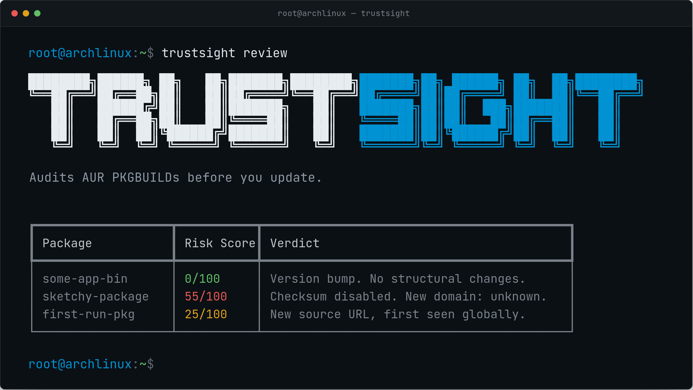

# TrustSight

Audits AUR PKGBUILDs before you update: catches careless malice and structural risk, and tells you what it can't verify.

Ready to get started? Head over to the [Getting Started](getting-started/) guide for installation and your first review.

---

## How scoring works

TrustSight computes a deterministic score from 0 to 100 for every AUR package update. The score is calculated entirely in Python from structured data: rule firings, URL classification, novelty tracking, and verification metadata. The LLM is optional and only translates the already-computed score into English; it cannot change it.

The scoring system is organized into four evidence tiers:

| Tier | Name | What it measures |
|------|------|-----------------|
| A | Structural | Pattern-matched rules against PKGBUILD commands (curl pipe bash, checksum disabled, sudo in functions) |
| B | Priors/Context | Domain reputation of new source URLs (trusted forge, official, unknown, homograph) |
| C | History/Novelty | First-seen URLs and maintainers, scaled by observation count |
| D | Verification | Cryptographic integrity metadata (checksums, PGP keys, GPG verify) subtracts from the score |

A package with checksums, a trusted forge source, and no rule firings scores 0. A package with `curl | bash` on an unknown domain with no checksum scores 75+. FATAL rules (prompt injection, unicode bidi overrides) hard-stop at 100.

**Key numbers:** 81.5% benign zero-rate, 100% CRITICAL recall, CRITICAL p5 = 40, benign p95 = 20.

See [How TrustSight Works](explanation/index.md) for the full pipeline explanation and [Rules Reference](reference/rules.md) for the complete rule catalog.

!!! tip "Rules Reference"

    TrustSight ships with 16 rules across two namespaces. **R001 to R013** detect command patterns (curl pipe bash, base64 decode, sudo in functions, checksum manipulation, unicode bidi overrides, prompt injection). **C001 to C003** catch structural anomalies (checksum changed without source change, source URLs swapped without version bump). Each rule has a severity, weight, match target, and scope that determine how it fires and what it contributes to the score.

    [Browse the full rule catalog &rarr;](reference/rules.md)

---

## Getting started

| Page | What it covers |
|------|----------------|
| [Installation](getting-started/installation.md) | Install via pip, AUR, or from source. Configure an LLM provider for English verdicts. |
| [Quickstart](getting-started/quickstart.md) | Run your first review, read the output table, understand the verdicts. |
| [Reading a Report](getting-started/reading-a-report.md) | Deep dive into score breakdown, evidence tiers, rule firings, and novelty context. |

## Explanation

| Page | What it covers |
|------|----------------|
| [How TrustSight Works](explanation/index.md) | Full pipeline: parse, analyze, score, classify, translate. |
| [Trust Model](explanation/trust-model.md) | Why deterministic core plus LLM-as-translator, verdict integrity assertions. |
| [Scoring Philosophy](explanation/scoring-philosophy.md) | Evidence tiers, verification subtraction, corpus-derived weights, rule design decisions. |
| [Cold Start and Maturity](explanation/cold-start-and-maturity.md) | Why novelty is meaningless on run one; maturity gating. |
| [What TrustSight Cannot See](explanation/what-trustsight-cannot-see.md) | The reasoned ceiling of the tool. |
| [Benchmarks and Methodology](explanation/benchmarks-and-methodology.md) | Per-class separation, CI gates, reproducible evaluation. |

## Reference

| Page | What it covers |
|------|----------------|
| [Rules](reference/rules.md) | R001 to R013 and C001 to C003 with severity, weight, and description. |
| [CLI](reference/cli.md) | Full command reference for review, inspect, history, config. |
| [Configuration](reference/configuration.md) | config.toml, rules.toml, and trusted_domains.toml schema. |
| [Report Schema](reference/report-schema.md) | PackageFact JSON structure. |
| [Evidence Tiers](reference/evidence-tiers.md) | A/B/C/D taxonomy with maturity gating. |

## Contributing

| Page | What it covers |
|------|----------------|
| [Development Setup](contributing/development-setup.md) | Set up a local dev environment. |
| [Writing a Rule](contributing/writing-a-rule.md) | R-series and C-series rule guidelines. |
| [Re-baselining](contributing/re-baselining.md) | Update benchmarks after scoring changes. |
