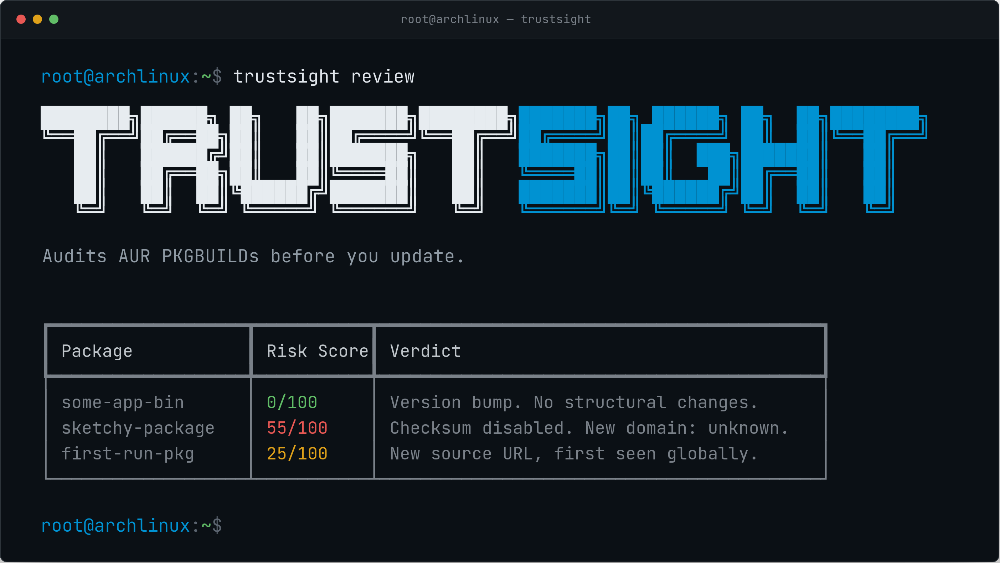

# TrustSight

Audits AUR PKGBUILDs before you update: catches careless malice and structural risk, and tells you what it can't verify.

TrustSight is an **instrument, not a judge**. It reports evidence - and the
absence of evidence - and never substitutes its report for your decision. Absence
of alerts is not a promise of safety. The [security model](security.md) states
the boundaries behind that promise, and how each one is enforced.

Ready to get started? Head over to the [Getting Started](getting-started/) guide for installation and your first review.

---

## How scoring works

TrustSight computes a deterministic score from 0 to 100 for every AUR package update. The score is calculated entirely in Python from structured data: rule firings, URL classification, novelty tracking, and verification metadata.

The scoring system is organized into four evidence tiers:

| Tier | Name | What it measures |
|------|------|-----------------|
| A | Structural | Pattern-matched rules against PKGBUILD commands (curl pipe bash, checksum disabled, sudo in functions) |
| B | Priors/Context | Domain reputation of new source URLs (trusted forge, official, unknown, homograph) |
| C | History/Novelty | First-seen URLs and maintainers, scaled by observation count |
| D | Verification | Declared integrity metadata (checksums, PGP keys, GPG verify) reported at weight 0, never scored |

A package with checksums, a trusted forge source, and no rule firings scores 0. A package with `curl | bash` on an unknown domain with no checksum scores 75+. FATAL rule findings (prompt injection or Unicode deception) hard-stop at 100. Confirmed IOC matches are reported separately with their curator attribution; they do not change the score or risk band.

**Key numbers:** 68.3% benign zero-rate, benign p95 = 35 against malicious p5 = 60 on the 3,739-diff locked corpus, 100% CRITICAL recall. The novelty seed recognises 86% of source URLs in a package's most recent update.

See [How TrustSight Works](explanation/index.md) for the full pipeline explanation and [Rules Reference](reference/rules/index.md) for the complete rule catalog.

!!! tip "Rules Reference"

    TrustSight ships 145 documented scoring rules across five families: 119 R-series detection rules, seven C-series structural rules, four D-series dependency rules, eight S-series sabotage rules, and seven X-series crossfire rules. The identifier space is intentionally non-contiguous; the [catalog](reference/rules/index.md) is authoritative and includes R132, R136-R143, S001-S008, and X001-X007. Declared-practice findings P001-P007 are reported at weight zero and never score. Each rule has a severity, weight, match target, and scope that determine how it fires and what it contributes to the score.

    [Browse the full rule catalog &rarr;](reference/rules/index.md)

---

## Getting started

| Page | What it covers |
|------|----------------|
| [Installation](getting-started/installation.md) | Build the repository's PKGBUILD with `makepkg`. |
| [Quickstart](getting-started/quickstart.md) | Run your first review, read the output table, understand the verdicts. |
| [Reading a Report](getting-started/reading-a-report.md) | Deep dive into score breakdown, evidence tiers, rule firings, and novelty context. |

## Explanation

| Page | What it covers |
|------|----------------|
| [How TrustSight Works](explanation/index.md) | Full pipeline: parse, analyze, score, classify, translate. |
| [Security Model](security.md) | What TrustSight guarantees while reading hostile input, why the score is deterministic and reproducible, what a verdict claims, and how each invariant is enforced. |
| [Scoring Philosophy](explanation/scoring-philosophy.md) | Evidence tiers, why verification is declared rather than scored, corpus-derived weights, rule design decisions. |
| [Cold Start and Maturity](explanation/cold-start-and-maturity.md) | Why novelty is meaningless on run one; maturity gating. |
| [Corpus and Priors](explanation/corpus-and-priors.md) | AUR-wide snapshot, global priors, local novelty weighting. |
| [Fire Rates](explanation/fire-rates.md) | Per-rule false-positive rates on the benign corpus. |
| [What TrustSight Cannot See](explanation/what-trustsight-cannot-see.md) | The reasoned ceiling of the tool. |
| [Benchmarks and Methodology](explanation/benchmarks-and-methodology.md) | Per-class separation, CI gates, reproducible evaluation. |

## Guides

| Guide | When to use it |
|-------|----------------|
| [Auditing Before Update](guides/auditing-before-update.md) | Everyday workflow: scan AUR packages before `yay -Syu`. |
| [Using in CI](guides/using-in-ci.md) | Gate package installs in CI/CD on the JSON report. |
| [Acting on a Flag](guides/acting-on-a-flag.md) | A package scored above 20 or returned INCONCLUSIVE - next steps. |
| [Configuring Rules and Weights](guides/configuring-rules-and-weights.md) | Edit `rules.toml` or `config.toml` to match your threat model. |
| [Tuning False Positives](guides/tuning-false-positives.md) | A rule is firing too often on your packages - identify and fix it. |
| [Running the Sandbox (aspirational)](guides/running-the-sandbox.md) | Rejected, not-yet-implemented design for sandboxing a PKGBUILD. |

## Reference

| Page | What it covers |
|------|----------------|
| [Rules](reference/rules/index.md) | Complete R/C/D/S/X catalog with severity, weight, and description. |
| [CLI](reference/cli.md) | Full command reference for review, inspect, history, config. |
| [Configuration](reference/configuration.md) | config.toml and its sibling rule, host, pattern, naming, threshold, and domain files. |
| [Report Schema](reference/report-schema.md) | Stored PackageFact and CLI/API report JSON shapes. |
| [Evidence Tiers](reference/evidence-tiers.md) | A/B/C/D taxonomy with maturity gating. |
| [Exit Codes](reference/exit-codes.md) | 0 (analysis completed), 2 (error), and why a flag is not an exit code. |

## Contributing

| Page | What it covers |
|------|----------------|
| [Development Setup](contributing/development-setup.md) | Set up a local dev environment. |
| [Writing a Rule](contributing/writing-a-rule.md) | R-series and C-series rule guidelines. |
| [Re-baselining](contributing/re-baselining.md) | Update benchmarks after scoring changes.

---

[Changelog](changelog.md) &middot; [Security](security.md) &middot; [License](license.md)
